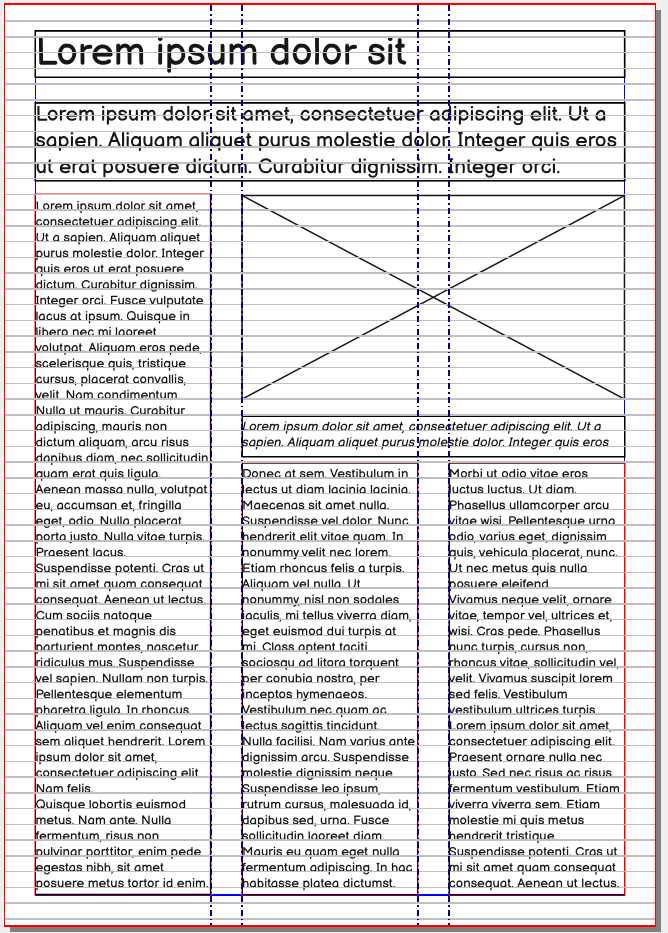
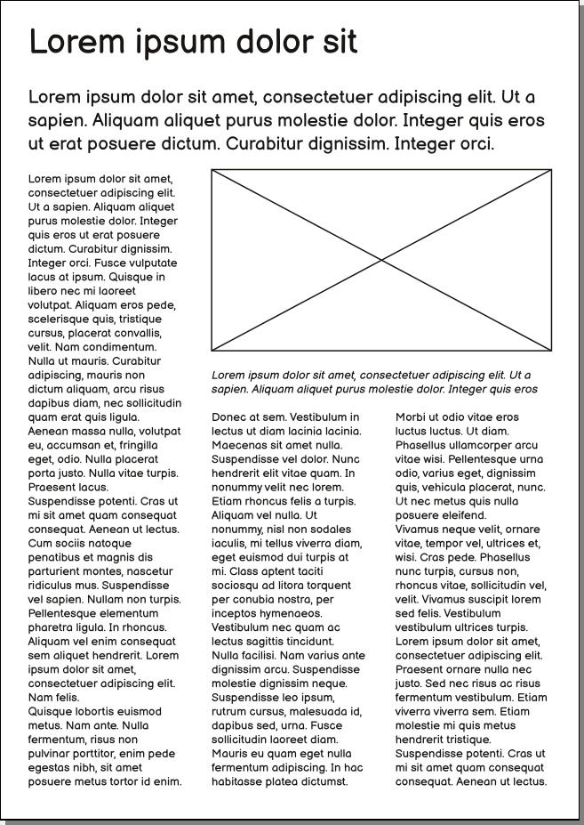

# Column layout with Scribus

Creating columns is a task required in many layouts. Scribus has two main ways of creating columns:

- By defining columns in the text frame properties.
- By creating "Column Guides".

While using the _Automatic Text Frames_ probably seems at first very tempting, in most cases creating _Column Guides_ is the better choice.

In this tutorial will first (and mainly) focus on using the column guides. Towards the end we will go through a few cases where the _Automatic Text Frames_ are a good fit and how to use them.

## Some typical column layouts

 

TODO: add screenshot and / or picture of column layouts.

## Basic principles

- Align to the baseline or use fixed line spacing

## Creating column guides

- Pick a matching left and right margins
- _Page > Manage Guides > Column / Row_, Number = 3, [x] Use Gap 10 mm, Refer to: Margins

## Adding the text frames

- Shift-click to insert columns

## Adding images

Often you will need to also add a caption and a copyright notice.

## Floating elements

- Avoid them.
- TODO: document how to do them

## Defining column inside of the text frames

- Can be used with Automatic Text Frames.
